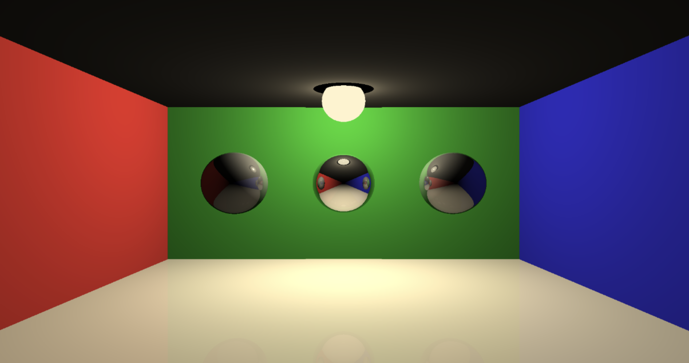

# 3d Raytracer

Making a 3d Raytracer in C


## Setup

- Install [SDL3](https://github.com/libsdl-org/SDL/blob/main/docs/INTRO-cmake.md)
- Generate a `compile_commands.json` with this command
  ```sh
    cmake -DCMAKE_EXPORT_COMPILE_COMMANDS=ON
  ```

- build and run


## Examples

### Cornell Box



### Solar System


